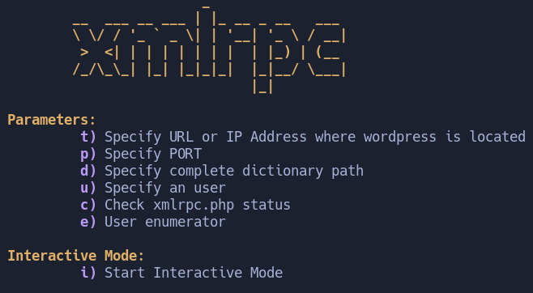
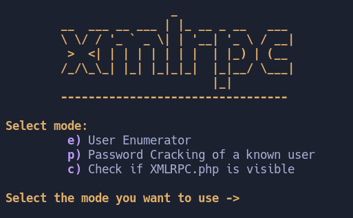
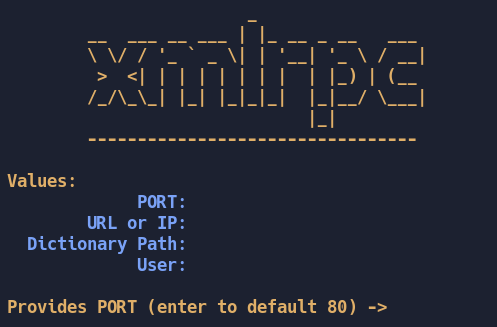

# xmlrpc-bruteforcer
XMLRPC Brute Forcer and User Enumerator for Wordpress
#xmlrpc.php Brute-Forcer & User Enumerator
<!---
Lenguaje: Bash
-->     

##Bruteforce passwords via xmlrpc 
Exposing the XML-RPC interface in a WordPress site can pose significant security risks. This interface allows for remote procedure calls, which, if not properly secured, can be exploited by attackers. Script takes advantage of this error by sending a large number of requests to the XML-RPC interface. This allows for rapid testing of user credentials, effectively enabling password cracking. It's crucial to understand that while this tool can be used for security testing.

##User Enumeration
The tool also includes a user enumeration feature. This is due to a particular behavior of WordPress: when a valid username is provided, regardless of the password, WordPress returns a distinct response compared to when an invalid username is provided. This tool capitalizes on this behavior to enumerate existing users, which can be invaluable for security testing purposes.

##Instalation
‘’’bash
git clone https://github.com/Ardillamas22/xmlrpc-bruteforcer 
cd xmlrpc-bruteforcer
chmod +x ./xmlrpc-bruteforcer
‘’’

##Usage

In terms of usage, the tool provides a straightforward 'helpPanel' message that explains how to use it. This message details all the necessary parameters and how to specify them. It serves as a guide, making the tool accessible and easy to use. This 'helpPanel' ensures that users can effectively utilize the tool for testing the security of WordPress sites.

##Interactive Mode

The tool also features an interactive mode. In this mode, users are first prompted to select the mode they wish to enter.

Once a mode has been selected in the interactive mode, the tool will then prompt the user for all the necessary parameters. This step-by-step process ensures that all required information is gathered 
